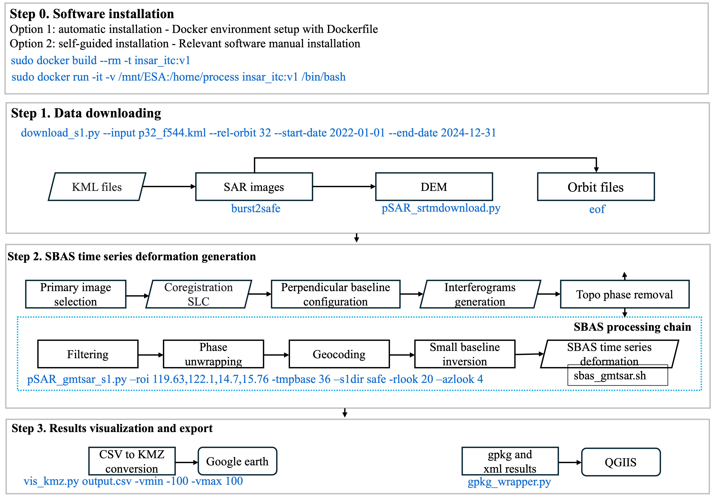
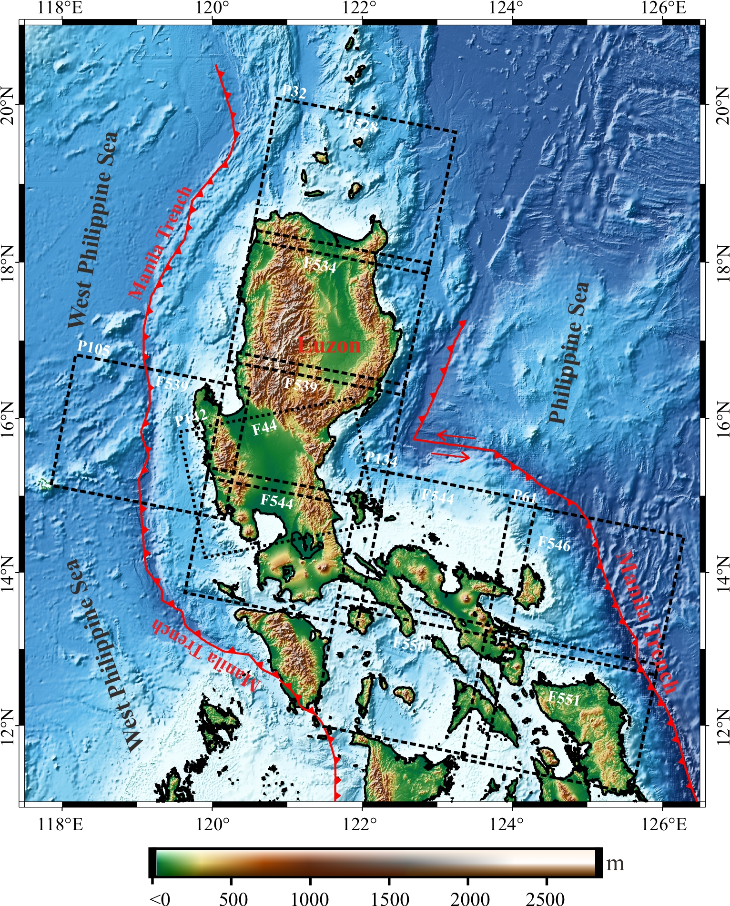
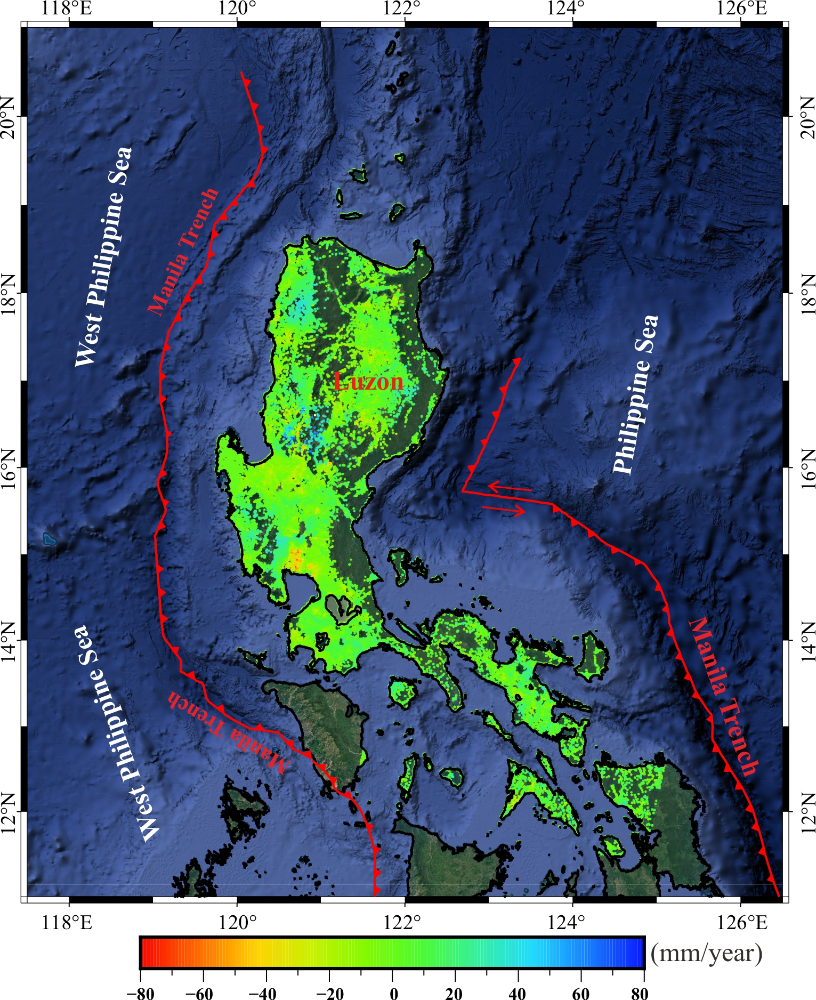

# SBAS Processing with GMTSAR+
# GMTSAR+

This repository provides an **end-to-end SBAS processing workflow** based on **GMTSAR+**, tailored for **local workstation deployment** and reproducible SBAS analysis.
**GMTSAR+** is an open-source, Docker-based workflow that extends **GMTSAR** for automated and reproducible Sentinel-1 SBAS-InSAR processing.

The workflow seamlessly integrates **data acquisition**, **interferometric processing**, **time-series inversion**, and **product export** into a unified command-line interface.
The workflow integrates Sentinel-1 data retrieval, orbit-file acquisition, DEM preparation, GMTSAR-SBAS processing, and standardized geospatial product generation into a unified command-line workflow. It exports InSAR deformation products in **CSV**, **GeoPackage**, **KMZ**, and **XML metadata** formats, supporting visualization, GIS analysis, product sharing, and processing traceability.

During the interferometric processing stage, we use the [**pSAR Python package**](https://github.com/wpfeng/pSAR), developed by **Associate Professor Wanpeng Feng** at **Sun Yat-sen University**.  
During the interferometric processing stage, we use selected scripts from the **pSAR** Python package, developed by Associate Professor **Wanpeng Feng** at Sun Yat-sen University.  
pSAR is a modular InSAR processing package designed to enhance GMTSAR-based SBAS workflows, supporting Sentinel-1 metadata parsing, SBAS interferogram pair selection, baseline filtering, metadata management, and handling of geospatial formats (e.g., NetCDF, GeoTIFF, ROI_PAC).  
For details on the provenance of pSAR and how it is used and extended in GMTSAR+, see **[update.md](./update.md)**.
GMTSAR+ is designed for local workstation and server-based deployment through Docker. Users do **not** need to manually install GMTSAR, GMT, GDAL/OGR, pSAR utilities, `burst2stack`, `eof`, or other dependencies on the host system.

---

## Main features

- Docker-based deployment for reproducible processing environments.
- Automated Sentinel-1 data retrieval using SAFE-based and burst-level workflows.
- Precise orbit-file acquisition using `eof`.
- DEM downloading and preparation for GMTSAR processing.
- End-to-end SBAS processing through `run_sbas.sh`.
- Integration with GMTSAR, GMT, GDAL/OGR, pSAR utilities, `burst2stack`, and `eof`.
- Standardized outputs in CSV, GeoPackage, KMZ, and XML metadata formats.
- Workflow documentation and command-line examples for reproducibility.

---

## Repository contents

```text
GMTSARplus/
├── README.md
├── LICENSE
├── Dockerfile
├── installation.md
├── scripts.md
├── update.md
├── run_sbas.sh
├── download_s1.py
├── meta_creator.py
├── gpkg_wrapper.py
├── vis_kmz.py
├── examples/
│   ├── README.md
│   ├── example_aoi.kml
│   └── example_run_command.sh
├── test_data/
│   ├── README.md
│   └── synthetic_output.csv
└── docs/
    └── figures/
```

Some files or folders may be added or reorganized as the software is updated. The key entry point for users is `run_sbas.sh`.

---

## Relation to pSAR

During the interferometric processing stage, GMTSAR+ uses selected scripts and utilities from the [pSAR package](https://github.com/wpfeng/pSAR), developed by Associate Professor Wanpeng Feng at Sun Yat-sen University.

pSAR provides useful tools for GMTSAR-based Sentinel-1 data preparation, interferogram generation, baseline handling, metadata management, and geospatial format conversion. In GMTSAR+, selected pSAR utilities are adapted and integrated into a Docker-based end-to-end SBAS processing workflow.

For details on the provenance of pSAR and how it is used and extended in GMTSAR+, see [update.md](./update.md).

---

## Documentation

- [Installation guide](./installation.md)
- [Script descriptions](./scripts.md)
- [pSAR update and provenance](./update.md)
- [Example commands](./examples/README.md)
- [Test data description](./test_data/README.md)

---

## Installation

GMTSAR+ is primarily distributed through Docker. The Docker image provides a controlled processing environment including GMTSAR, GMT, GDAL/OGR, Python utilities, pSAR scripts, `burst2stack`, `eof`, and all required runtime dependencies.

### Requirements

- Linux operating system, Ubuntu 18.04 or later recommended
- Docker
- Sufficient disk space for Sentinel-1 SAR data and processing outputs
- Multi-core CPU recommended for large-area processing
- Sufficient memory for Sentinel-1 time-series InSAR processing
- Valid data-access credentials for Sentinel-1 data downloading when required

### Clone the repository

```bash
git clone https://github.com/Bingquan-InSAR/GMTSARplus.git
cd GMTSARplus
```

### Build the Docker image

```bash
docker build -t gmtsarplus:latest .
```

### Run the Docker container

Create a working directory on the host machine:

```bash
mkdir -p /mnt/gmtsarplus_work
```

Run GMTSAR+ in Docker:

```bash
docker run -it --rm \
  -v /mnt/gmtsarplus_work:/home/process \
  -w /home/process \
  gmtsarplus:latest \
  bash
```

Here, `/mnt/gmtsarplus_work` is the working directory on the host machine, and `/home/process` is the working directory inside the container.

### Verify the Docker environment

Inside the container, check the main software components:

```bash
gmt --version
gdalinfo --version
python --version
which run_sbas.sh
which pSAR_gmtsar_s1.py
which burst2stack
which eof
```

---

## 📖 Documentation
## Data access configuration

Before running automated Sentinel-1 downloads, make sure that valid credentials are configured for the required data services.

A typical `.netrc` file should include credentials for:

- `urs.earthdata.nasa.gov` — NASA Earthdata
- `dataspace.copernicus.eu` — Copernicus Data Space Ecosystem

Example:

```text
machine urs.earthdata.nasa.gov
  login YOUR_EARTHDATA_USERNAME
  password YOUR_EARTHDATA_PASSWORD

machine dataspace.copernicus.eu
  login YOUR_COPERNICUS_USERNAME
  password YOUR_COPERNICUS_PASSWORD
```

For security, restrict the file permission:

1. [Installation](./installation.md)  
2. Running GMTSAR+
```bash
chmod 600 ~/.netrc
```

---

## 🚀 `run_sbas.sh`
## Quick start

After entering the Docker container, run GMTSAR+ using `run_sbas.sh`.

```bash
run_sbas.sh \
  --kml airport.kml \
  --st 20240101 \
  --ed 20240131 \
  --rel_orbit 11 \
  --tmpbase 12 \
  --rlook 20 \
  --azlook 4
```

This command performs SBAS processing for the AOI defined by `airport.kml` between 1 January 2024 and 31 January 2024, using Sentinel-1 relative orbit 11, a temporal baseline threshold of 12 days, and multilooking factors of 20 and 4 in range and azimuth directions, respectively.

---

**An end-to-end SBAS processing wrapper built on GMTSAR+.**
## `run_sbas.sh`

`run_sbas.sh` is an end-to-end SBAS processing wrapper built on GMTSAR+.

The script encapsulates the complete processing chain into a single command, including:

1. AOI definition and bounding-box extraction from a vector file (KML)  
2. Sentinel-1 burst/SAFE acquisition via `download_s1.py` and `burst2stack`  
3. Precise orbit retrieval using `eof`  
4. SBAS processing and product generation through  
   `pSAR_gmtsar_s1.py`, `meta_creator.py`, and `gpkg_wrapper.py`
1. AOI definition and bounding-box extraction from a KML file
2. Sentinel-1 burst/SAFE acquisition using `download_s1.py` and `burst2stack`
3. Precise orbit retrieval using `eof`
4. DEM downloading and preparation
5. GMTSAR-SBAS processing using `pSAR_gmtsar_s1.py`
6. Standardized product generation using `meta_creator.py`, `gpkg_wrapper.py`, and `vis_kmz.py`

---

## 🧾 Usage
## Usage

```text
usage: run_sbas.sh [-h|--help]
@@ -46,109 +207,313 @@ usage: run_sbas.sh [-h|--help]
                  --rlook <int> --azlook <int>
```

### Arguments

| Argument | Description |
|---|---|
| `--kml` | Area of interest file in KML format |
| `--st` | Start date in `YYYYMMDD` format |
| `--ed` | End date in `YYYYMMDD` format |
| `--rel_orbit` | Sentinel-1 relative orbit number |
| `--tmpbase` | Temporal baseline threshold in days |
| `--rlook` | Range multilooking factor |
| `--azlook` | Azimuth multilooking factor |

---

## Input files

### AOI file

The main required input is a KML file defining the area of interest.

Example:

```text
airport.kml
```

The AOI bounding box is automatically derived in EPSG:4326 and formatted as:

```text
west,east,south,north
```

This format is required by `pSAR_gmtsar_s1.py -roi`.

### Date range

The start and end dates are provided using:

```bash
--st <YYYYMMDD>
--ed <YYYYMMDD>
```

### Orbit and SBAS parameters

The relative orbit number and SBAS processing parameters are provided using:

```bash
--rel_orbit <int>
--tmpbase <days>
--rlook <int>
--azlook <int>
```

---

## Workflow description

The script executes a complete SBAS workflow from data acquisition to final product export.

- The area of interest is specified using `--kml`.
- The AOI bounding box is automatically derived in EPSG:4326.
- Sentinel-1 data are downloaded or organized in the local working directory.
- Precise orbit files are retrieved and cached under `$S1_ORB/aux_poeorb`.
- DEM data are downloaded and prepared for GMTSAR processing.
- SBAS processing is executed using the GMTSAR-based processing chain.
- Final products are exported in standardized geospatial formats.

---

## 📝 Description
## Processing workflow

The script executes a complete SBAS workflow from data download to final product export—in a single command.
If workflow figures are included in the repository, they can be placed under `docs/figures/`.

- The area of interest (AOI) is specified via `--kml`.
- The AOI bounding box is automatically derived in **EPSG:4326** and formatted as  
  `west,east,south,north`, as required by `pSAR_gmtsar_s1.py (-roi)`.
- Downloaded Sentinel-1 data are stored in a local working directory (`./safe`).
- Precise orbit files are retrieved and cached under:  
  `$S1_ORB/aux_poeorb`.
Example:

```markdown
<p align="center">
  
</p>
```

If the figure file is not available, remove the image block from this README to avoid broken links.

---

## 📦 Outputs
## Outputs

All outputs are generated within the working directory:
All outputs are generated within the working directory.

- `sbas/output.csv`  
  SBAS deformation results produced by the processing chain
  Original SBAS deformation results generated by the GMTSAR-based processing chain.

- `output.csv`  
  A copy of the SBAS results exported from `sbas/output.csv`
  Standardized CSV output containing point coordinates, velocity, RMSE, and time-series deformation.

- `output.gpkg`  
  GIS-ready GeoPackage product for spatial analysis and visualization.

- `output.gpkg` and `output.xml`  
  Final geospatial products generated by `gpkg_wrapper.py`
- `output.kmz`  
  Google Earth visualization product with deformation velocity and point-wise time-series plots.

- `output.xml`  
  Metadata file recording acquisition dates, processing parameters, filtering information, and product-generation details.

---

## ▶️ Example
## Expected behaviour

```bash
run_sbas.sh --kml airport.kml --st 20240101 --ed 20240131 \
            --rel_orbit 11 --tmpbase 12 --rlook 20 --azlook 4
```
A successful GMTSAR+ run should:

---
1. Read the AOI from the input KML file.
2. Derive the geographic bounding box in EPSG:4326.
3. Download or organize Sentinel-1 data according to the specified time range and relative orbit.
4. Retrieve precise orbit files.
5. Prepare DEM data.
6. Generate interferograms and perform SBAS time-series processing.
7. Export deformation products in CSV, GeoPackage, KMZ, and XML metadata formats.

For detailed descriptions of the core scripts involved in this workflow  
(e.g., `pSAR_gmtsar_s1.py`, `meta_creator.py`, `gpkg_wrapper.py`,  
`sbas_gmtsar.sh`, `vis_kmz.py`, `download_s1.py`, `eof`, `burst2stack`,  
and `pSAR_srtmdownload.py`), please refer to [`scripts.md`](scripts.md).
If any required input file, orbit file, Sentinel-1 data product, or processing dependency is missing, the workflow should report the error in the terminal or processing logs.

---

## 🔐 1. Data Access Configuration
## Reproducibility note

The full Sentinel-1 SAR datasets used in the manuscript case studies are not redistributed in this repository because of their large data volume.

Prior to execution, ensure that valid credentials are configured in your `.netrc` file for the following services:
Instead, this repository provides:

- `urs.earthdata.nasa.gov` — NASA Earthdata  
- `dataspace.copernicus.eu` — Copernicus Data Space Ecosystem  
- Docker-based installation instructions
- Workflow documentation
- Processing scripts
- Example command-line usage
- Parameter descriptions
- Output product descriptions
- Optional lightweight test materials for checking output-generation utilities

These materials allow users and reviewers to understand and reproduce the GMTSAR+ workflow structure. The required Sentinel-1 SAR data can be accessed through Copernicus/ESA data access services or the Alaska Satellite Facility using valid user credentials.

---

## ⚙️ 2. Workflow Overview
## Example and test materials

### Processing Workflow
The repository may include lightweight example and test materials under:

<p align="center">
  
</p>
```text
examples/
test_data/
```

These materials are intended to demonstrate input structure, command-line usage, and output-generation behaviour. They are not intended to replace the full Sentinel-1 datasets used in the manuscript case studies.

A minimal example directory can include:

```text
examples/
├── README.md
├── example_aoi.kml
└── example_run_command.sh
```

A minimal synthetic test directory can include:

```text
test_data/
├── README.md
├── synthetic_output.csv
└── synthetic_metadata.xml
```

The synthetic test files can be used to verify selected post-processing utilities, such as CSV-to-GeoPackage conversion, KMZ visualization generation, and metadata creation, without downloading large Sentinel-1 SAR datasets.

---

## Example command

```bash
run_sbas.sh \
  --kml airport.kml \
  --st 20240101 \
  --ed 20240131 \
  --rel_orbit 11 \
  --tmpbase 12 \
  --rlook 20 \
  --azlook 4
```

---

## 🛰️ 3. Example Results
## Example results

If example figures are included, place them under `docs/figures/` and update the paths below:

```markdown
<p align="center">
  
  
&nbsp;&nbsp;&nbsp;
  
  
</p>
```

If these files are not available in the repository, remove this section to avoid broken image links.

---

## Software environment

GMTSAR+ is executed inside a Docker container. The Docker environment includes the required processing tools and dependencies, including:

- GMTSAR
- GMT
- GDAL/OGR
- Python utilities
- pSAR scripts
- `burst2stack`
- `eof`

Users are not expected to install these dependencies manually on the host system.

---

## Computational requirements

The required computational resources depend on the study area, number of Sentinel-1 acquisitions, number of interferometric pairs, multilooking factors, and output resolution.

Recommended resources:

- Operating system: Linux, Ubuntu 18.04 or later recommended
- CPU: multi-core processor recommended
- Memory: sufficient memory for Sentinel-1 time-series InSAR processing
- Storage: large disk space is required for Sentinel-1 SAR data, interferograms, SBAS products, and final outputs
- Runtime environment: Docker

For large-area or multi-year Sentinel-1 processing, users should ensure that adequate storage and processing resources are available before running the workflow.

---

## Core scripts

The main scripts used in the workflow include:

- `run_sbas.sh`
- `download_s1.py`
- `pSAR_gmtsar_s1.py`
- `sbas_gmtsar.sh`
- `vis_kmz.py`
- `meta_creator.py`
- `gpkg_wrapper.py`
- `pSAR_srtmdownload.py`

For detailed descriptions of the core scripts, see [scripts.md](./scripts.md).

---

## 📬 4. Contact
## Code comments

Development and discussion primarily take place on GitHub.  
Users are encouraged to open an issue or comment on existing issues or pull requests.
All comments in the source code should be written in English. If non-English comments are found, they should be translated before release or submission.

---

## 📚 5. References
## Code availability

The source code, Dockerfile, installation instructions, workflow documentation, and command-line examples are publicly available in this repository.

Full Sentinel-1 SAR datasets are not included because of their large volume. Users can obtain the required SAR data from public Sentinel-1 data services and run the workflow using the provided Docker-based environment and processing commands.

---

## License

GMTSAR+ is released under the MIT License. See the [LICENSE](./LICENSE) file for details.

---

## Contact

Development and discussion primarily take place on GitHub.

Users are encouraged to open an issue for:

- Installation problems
- Docker-related questions
- Data access issues
- Processing errors
- Suggestions for improvement

---

## References

- GMTSAR GitHub Repository  
https://github.com/gmtsar/gmtsar

- pSAR GitHub Repository  
  https://github.com/wpfeng/pSAR

- INSAR_G2S GitHub Repository  
https://github.com/dedetmix/INSAR_G2S

- StaMPS GitHub Repository  
https://github.com/dbekaert/StaMPS

- pSAR GitHub Repository  
  https://github.com/wpfeng/pSAR

- Li, B., & Chang, L. (Submitted).  
  **GMTSAR+**: An extended GMTSAR workflow streamlining SBAS products with standardized geospatial outputs.  
  *Submitted to Environmental Modelling & Software*.
  
  **GMTSAR+: An extended GMTSAR workflow streamlining SBAS products with standardized geospatial outputs.**

---

## 🙏 Acknowledgment
## Acknowledgment

This work was supported by ESA, PhilSA, and collaborating project partners.
The authors acknowledge ESA for providing free and open Sentinel-1 data. We also acknowledge the pSAR package developed by Associate Professor Wanpeng Feng, which provides useful scripts and utilities for GMTSAR-based InSAR processing and forms an important technical basis for the development of GMTSAR+.
